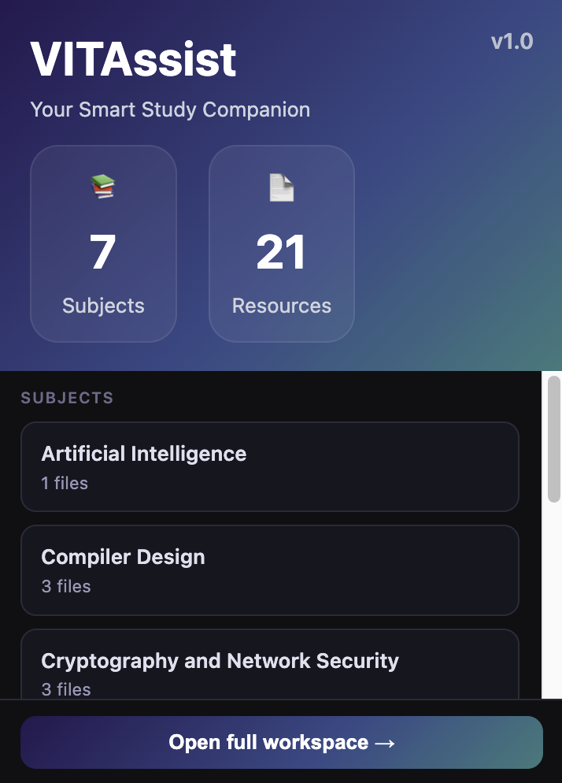
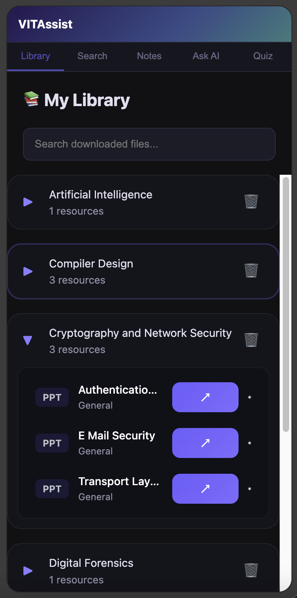
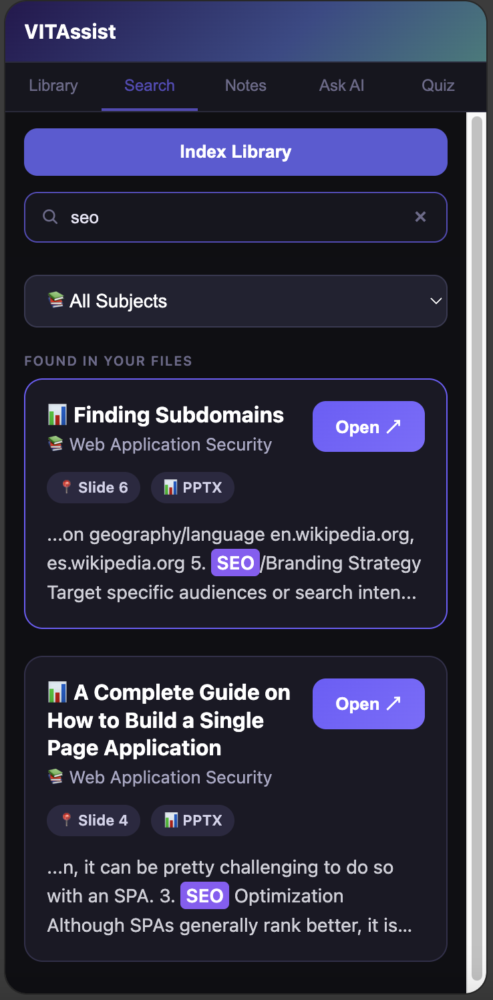
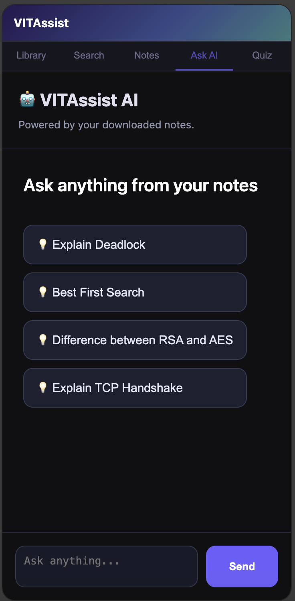
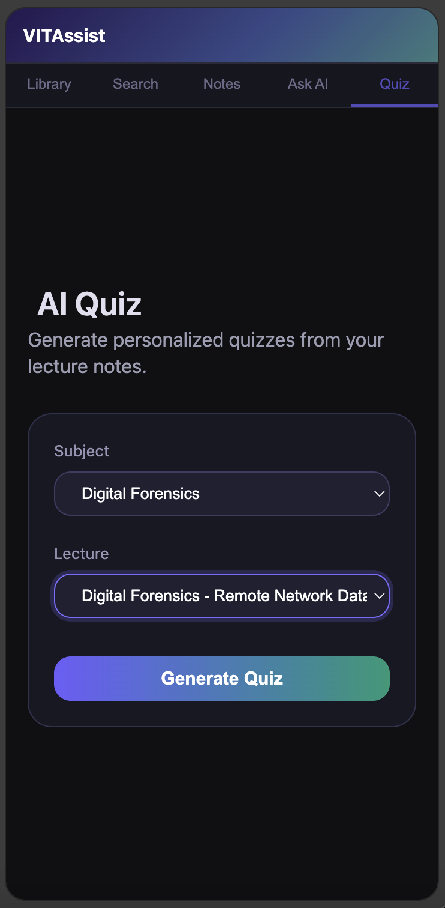

<div align="center">

# 🎓 VITAssist

### AI-Powered Chrome Extension for Organizing & Learning from VIT Study Materials

Automatically organize VTOP study materials, search lecture content, ask AI questions, and generate AI-powered quizzes—all from a modern Chrome Side Panel.

<br/>


<br/><br/>


</div>

---

# 📖 About

VITAssist is an AI-powered Chrome Extension designed to simplify how VIT students organize, search, and study course materials downloaded from VTOP.

The extension automatically detects downloaded PDFs and PowerPoint presentations, organizes them by subject, extracts and indexes their contents locally, and provides intelligent study tools including semantic search, contextual question answering using Lightweight Retrieval-Augmented Generation (RAG) powered by Llama 3.3 70B through the Groq API, AI-powered quiz generation, and an integrated study library—all accessible through a modern Chrome Side Panel.

---

# ✨ Features

- 📂 Automatically detects and organizes downloaded VTOP study materials by subject
- 📄 Supports both PDF and PowerPoint lecture materials
- 🔍 Full-text semantic search across indexed lecture content
- 🤖 AI-powered Question Answering using Llama 3.3 70B with Lightweight Retrieval-Augmented Generation (RAG)
- 🧠 AI-powered quiz generation from selected courses and lecture files
- 📚 Context-aware AI responses generated only from your indexed study materials
- 📖 Integrated Library for browsing and managing indexed resources
- 🗑️ Per-file deletion with automatic cleanup of indexed data and metadata
- ⚡ Modern Chrome Side Panel workspace for seamless studying

---

# 🚀 Workflow

```text
                 VTOP Study Material
                        │
                        ▼
            Automatic Download Detection
                        │
                        ▼
         Rename & Organize by Subject
                        │
                        ▼
              PDF / PPT Text Extraction
                        │
                        ▼
           Local Searchable Content Index
                        │
      ┌─────────────────┼─────────────────┐
      ▼                 ▼                 ▼
   Library       Semantic Search      AI Features
                                             │
                                  ┌──────────┴──────────┐
                                  ▼                     ▼
                             Ask AI (RAG)       Quiz Generator
```

---

# 🧠 AI Features

## Ask AI


Uses a Lightweight Retrieval-Augmented Generation (RAG) pipeline to retrieve the most relevant sections from locally indexed lecture materials before sending the context to Meta's Llama 3.3 70B model through the Groq API. This enables fast, accurate, lecture-specific responses while minimizing hallucinations.
---

## Semantic Search

Searches the actual contents of PDFs and PowerPoint presentations instead of relying only on filenames, making it easy to locate concepts across all downloaded study materials.

---

## AI Quiz Generator

Generate AI-powered multiple-choice quizzes from any indexed lecture.

Simply choose a course, select a PDF or PowerPoint presentation, and VITAssist uses Meta's Llama 3.3 70B model through the Groq API to generate topic-specific multiple-choice questions based solely on the selected lecture. This enables focused self-assessment and exam preparation for individual topics.

---

## Integrated Library

Browse all indexed study materials organized by subject, quickly access downloaded resources, and remove files with automatic cleanup of associated indexed metadata.

---

# 🛠 Tech Stack

### Frontend

- React
- Vite
- JavaScript
- CSS

### AI

- Groq API
- Meta Llama 3.3 70B
- Lightweight Retrieval-Augmented Generation (RAG)

### Chrome Extension

- Chrome Extension Manifest V3
- Chrome Downloads API
- Chrome Storage API
- Chrome Side Panel API

### Document Processing

- PDF.js
- Mammoth.js
- JSZip
- Tesseract.js

---

# 📂 Project Structure

```text
src/
│
├── popup/
├── sidepanel/
│   ├── components/
│   ├── tabs/
│   └── styles/
│
├── shared/
│   ├── ai/
│   ├── parser/
│   ├── search/
│   ├── storage/
│   └── utils/
│
├── background.js
├── content.js
└── manifest.json
```

---

# ⚙ Installation

Clone the repository

```bash
git clone https://github.com/Kikimoko/VITAssist.git
```

Navigate into the project

```bash
cd VITAssist
```

Install dependencies

```bash
npm install
```

Create a `.env` file

```env
VITE_GROQ_API_KEY=YOUR_GROQ_API_KEY
```

Build the extension

```bash
npm run build
```

Load the generated **dist** folder as an unpacked extension:

1. Open **Google Chrome**
2. Navigate to **chrome://extensions/**
3. Enable **Developer Mode**
4. Click **Load unpacked**
5. Select the generated **dist** folder

---

# 📸 Screenshots

| Popup | Library |
|-------|----------|
|  |  |

| Search | Ask AI |
|-------|----------|
|  |  |

| Quiz Generator |
|----------------|
|  |

---

# 🚀 Future Improvements

- Improve semantic search ranking
- Better OCR support for scanned PDFs and presentations
- Faster indexing for large libraries
- Support additional document formats
- AI-generated flashcards
- Cloud synchronization across devices

---

# 👩‍💻 Author

**Kalyani Manoj**

B.Tech Computer Science and Engineering (Information Security)  
VIT Vellore

---

<div align="center">

### ⭐ If you found this project useful, consider giving it a star!

</div>

---

# 📄 License

Copyright © 2026 Kalyani Manoj.

**All Rights Reserved.**

This repository is published for portfolio and educational viewing purposes only.

No part of this source code may be copied, modified, redistributed, or reused without prior written permission from the author.