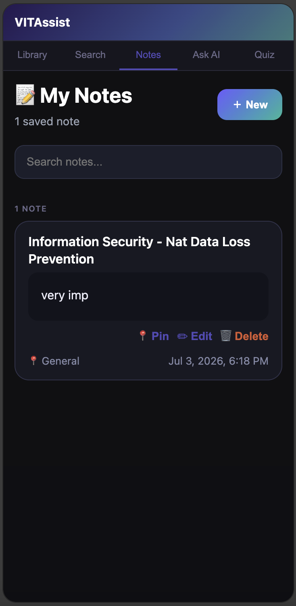

<div align="center">

# 🎓 VITAssist

### AI-Powered Chrome Extension for Organizing & Learning from VIT Study Materials

Automatically organize VTOP study materials, search lecture content, ask AI questions, generate revision notes, and create quizzes—all from a single Chrome side panel.

<br/>


<br/><br/>


</div>

---

# 📖 About

VITAssist is a Chrome Extension built to improve the way VIT students manage and study course materials downloaded from VTOP.

The extension automatically organizes downloaded PDFs and PowerPoint presentations, indexes their contents locally, and provides AI-assisted study tools such as semantic search, contextual question answering, revision note generation, and quiz generation.

---

# ✨ Features

- 📂 Automatically organizes downloaded VTOP study materials by subject
- 🔎 Searches inside PDFs and PowerPoint presentations using lecture content
- 🤖 AI-powered Question Answering using Lightweight Retrieval-Augmented Generation (RAG)
- 📚 Context-aware answers generated only from your downloaded study materials
- 📝 Generate concise revision notes from individual lectures
- 🧠 Generate multiple-choice quizzes from any selected lecture
- 📖 Browse indexed study materials through an integrated library
- ⚡ Chrome Side Panel workspace for quick access while studying

---

# 🚀 Workflow

```text
VTOP Download
      │
      ▼
Automatic File Detection
      │
      ▼
Organize by Subject
      │
      ▼
PDF / PPT Parsing
      │
      ▼
Local Content Index
      │
      ├──────────────┐
      ▼              ▼
 Search         Ask AI (Lightweight RAG)
      │              │
      └──────┬───────┘
             ▼
      Notes & Quiz Generation
```

---

# 🧠 AI Features

## Ask AI

Uses Lightweight Retrieval-Augmented Generation (RAG) to retrieve relevant sections from indexed lecture materials before sending the context to Gemini AI for accurate responses.

---

## Smart Search

Searches lecture contents instead of relying only on filenames, making it easier to find concepts across PDFs and presentations.

---

## Revision Notes

Generates concise AI-powered notes from individual lectures for quick revision.

---

## Quiz Generator

Creates multiple-choice quizzes with explanations based on the selected lecture.

---

# 🛠 Tech Stack

### Frontend

- React
- Vite
- JavaScript
- CSS

### AI

- Google Gemini API
- Lightweight Retrieval-Augmented Generation (RAG)

### Chrome Extension

- Chrome Extension Manifest V3
- Chrome Storage API
- Chrome Downloads API
- Chrome Side Panel API

### Document Processing

- PDF.js
- Mammoth.js

---

# 📂 Project Structure

```text
src/
│
├── background/
├── content/
├── popup/
├── sidepanel/
│
├── shared/
│   ├── ai/
│   ├── indexer/
│   ├── parser/
│   ├── search/
│   └── storage/
│
└── manifest.json
```

---

# ⚙ Installation

Clone the repository

```bash
git clone https://github.com/YOUR_USERNAME/VITAssist.git
```

Install dependencies

```bash
npm install
```

Create a `.env`

```env
VITE_GEMINI_API_KEY=YOUR_API_KEY
```

Build the extension

```bash
npm run build
```

Load the generated `dist` folder as an unpacked extension from Chrome Extensions.

---


# 📸 Screenshots

| Popup | Library |
|-------|----------|
|  |  |

| Search | Ask AI |
|-------|----------|
|  |  |

| Notes | Quiz |
|-------|----------|
|  |  |

# 🚀 Future Improvements

- Improve semantic search ranking
- Better OCR support for scanned PDFs
- Faster indexing for large libraries
- Enhanced UI and user experience

---

# 👩‍💻 Author

**Kalyani Manoj**

B.Tech Computer Science and Engineering (Information Security)
VIT Vellore

---

<div align="center">

### ⭐ If you found this project useful, consider giving it a star!

</div>
